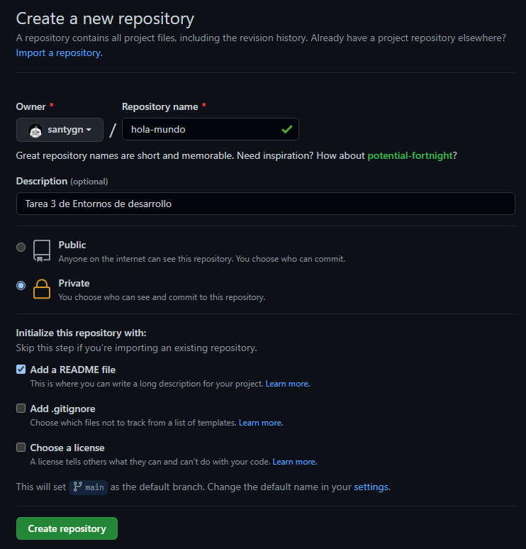

# hola-mundo
## Tarea 3 de Entornos de desarrollo- Santiago Guillén

# Pasos a seguir
- Dentro de Github hemos de presionar en `New` para crear un nuevo repositorio.

 

- Accederemos a *Create new repository* donde hemos de añadir como título **hola-mundo** y una pequeña descripción del proyecto.
- Presionamos la opción de *Add a README file*
- Seguidamente damos click en *create repository* y el repositorio quedará creado.

- Una vez creado el repositorio hemos de crear una nueva rama a partir de la rama main.
- Para crear una rama tenemos que hacer click en main y ponerle un nombre a la nueva rama.

